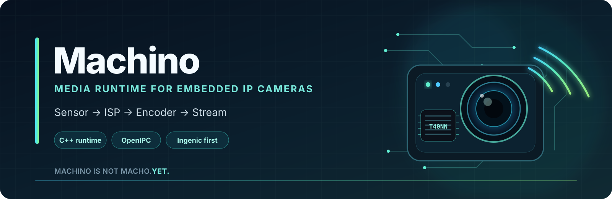

<div align="center">



### The universal media runtime for every IP camera ever made.

<sub>Support may currently be limited to cameras we actually tested.</sub>

</div>

---

## What is Machino?

Machino is a new media runtime for embedded IP cameras, designed as a lightweight
replacement for monolithic camera streamers such as Majestic.

The long-term goal is deliberately ambitious:

> **Support every camera. Or at least plan to.**

Machino is not a firmware distribution. It is intended to run on top of systems
such as [OpenIPC](https://openipc.org/) and provide the media layer: sensor / ISP
initialisation, hardware encoding, streaming, snapshots, audio, detection and a
small control API for the WebUI.

The first hardware family is **Ingenic**. Other SoCs are planned through a strict
ports-and-adapters architecture rather than by spreading vendor-specific code
through the core.

---

## Design goals

Machino is being built around a few non-negotiable rules:

- **One lightweight process** — no fleet of always-running media microservices.
- **Battery-first design** — power consumption is an architectural concern, not a
  later optimisation pass.
- **No consumer, no pipeline** — inactive media pipelines should not keep the
  sensor, ISP, encoder or AI hardware busy unnecessarily.
- **Efficient continuous streaming** — when a stream must stay online, Machino
  should minimise clocks, active pipelines, copies, wakeups and unnecessary
  hardware blocks.
- **C++ runtime** — embedded-oriented C++, RAII, bounded resources and minimal
  dependencies.
- **Ports & adapters** — the media core does not know whether it is running on
  Ingenic, HiSilicon, SigmaStar, Goke or something else.
- **Drop-in direction for Majestic** — compatibility is implemented at the edge,
  without coupling the core to Majestic internals.
- **WebUI-first control API** — capabilities, runtime settings and telemetry are
  exposed through a stable API.
- **Hardware acceleration stays hardware accelerated** — vendor ISP, encoder and
  AI/NPU capabilities should be used where available instead of replaced with
  expensive software paths.

---

## Architecture

```text
                         Machino

+-----------------------------------------------------------+
| Application                                               |
| RTSP | HTTP/JPEG | Control API | ONVIF | AI | Recording   |
+-----------------------------------------------------------+
| Domain / Media Core                                       |
| Stream | Frame | Encoder | Sensor | Events | Power Policy |
+-----------------------------------------------------------+
| Ports                                                     |
| ISensor | IISP | IEncoder | IAudio | IAI | IPower | I/O  |
+-----------------------------------------------------------+
| Adapters                                                  |
|                                                           |
|  +-------------------+   +-----------------------------+  |
|  | Ingenic           |   | Future adapters             |  |
|  | IMP / JZDL / MXU  |   | HiSilicon / SigmaStar /    |  |
|  |                   |   | Goke / ...                  |  |
|  +-------------------+   +-----------------------------+  |
+-----------------------------------------------------------+
```

Vendor-specific details belong in adapters. RTSP, HTTP, configuration,
authentication, WebUI integration and the media lifecycle remain platform
independent.

The first implementation target is:

```text
OpenIPC Linux
    +
Ingenic T40/T40NN
    +
Ingenic SDK 1.3.1
    +
IMX307
    +
Machino
```

---

## Power model

Battery operation is a primary use case.

### On-demand mode

```text
NO CONSUMER
    |
    +--> no encoder
    +--> no FrameSource
    +--> no AI inference
    +--> ISP / sensor may enter low-power state
```

When a client requests RTSP, a snapshot, recording or detection, Machino brings
up only the required pipeline. When the last consumer disappears, the pipeline
can be torn down again after a short configurable grace period.

### Continuous-stream mode

Sometimes the camera must stream permanently. In that case the goal changes
from "turn it off" to "run only what is required".

Machino is intended to expose and optimise, where the platform supports it:

- sensor mode and sensor FPS
- stream resolution and FPS
- codec, bitrate and rate-control settings
- number of active streams
- JPEG / snapshot pipeline
- audio pipeline
- OSD
- AI / detection and independent inference rate
- ISP performance / clock
- encoder / AVPU performance / clock
- CPU frequency / governor where Linux exposes it
- active hardware blocks
- runtime CPU, memory, bitrate, FPS, frame-drop and clock telemetry

The preferred implementation is event driven. No busy polling just to prove the
daemon is alive.

---

## Control API and WebUI integration

Machino will provide a runtime API specifically so an OpenIPC-style WebUI can
configure the media pipeline without knowing vendor-specific details.

The API is planned around three concepts:

### Capabilities

The adapter reports what the current hardware can actually do.

```json
{
  "platform": "ingenic-t40nn",
  "power": {
    "sensor_fps": true,
    "isp_clock": true,
    "encoder_clock": true,
    "cpu_frequency": false,
    "ai_rate": true
  }
}
```

A WebUI can therefore hide or disable controls that do not exist on a given
camera instead of relying on model-name guesses.

### Runtime state and telemetry

The API should expose effective values, not only requested configuration:

- active streams
- effective sensor and stream FPS
- current bitrate
- dropped frames
- CPU and RSS
- active encoder / JPEG / audio / AI pipelines
- current clocks / performance levels where readable

### Runtime configuration

Supported settings should report whether a change is:

- live-applicable
- media-pipeline restart required
- daemon restart required
- unsupported

Optional presets may provide `performance`, `balanced`, `battery` and
`custom` profiles, while always exposing the actual underlying values.

---

## Majestic compatibility

Machino is intended to become a practical replacement for Majestic on OpenIPC,
but compatibility is a boundary layer rather than the internal architecture.

```text
OpenIPC / WebUI / existing integrations
                 |
        Majestic compatibility
                 |
             Machino Core
```

Compatibility will be added incrementally for the interfaces that are useful in
practice. Machino does **not** aim to reproduce every historical Majestic
implementation detail internally.

---

## Platform support

| Platform | Status |
| --- | --- |
| Ingenic T40 / T40NN | **First target — hardware validation in progress** |
| Other Ingenic T-series | Planned through the Ingenic adapter |
| HiSilicon | Planned |
| SigmaStar | Planned |
| Goke | Planned |
| Everything else | Obviously. Eventually. Probably. |

The architecture is universal by design. Hardware support is only claimed once
it has actually been implemented and tested.

---

## Current project status

Machino is currently in the **hardware de-risk / architecture transition** phase.

This repository started from
[Lu-Fi/timps](https://github.com/Lu-Fi/timps) as an MIT-licensed reference and
hardware-validation baseline. timps is written in C and talks directly to the
Ingenic IMP SDK.

The production direction for Machino is different:

- a new **C++** runtime
- hexagonal / ports-and-adapters architecture
- power-aware lifecycle management
- a platform-neutral core
- Ingenic as the first adapter
- timps retained as a reference for known-good IMP call sequences and hardware
  quirks, not as the final architecture

The current T40NN validation work is intentionally proving the vendor stack
before the full C++ runtime is built.

Do not interpret the presence of timps-derived prototype code as the final
Machino architecture.

---

## Why not Raptor or prudynt?

They solve related problems, but Machino has a different design target.

Raptor uses a modular multi-service architecture and is GPL-3.0. Machino instead
targets a single lightweight process with aggressive power management.

prudynt is a traditional monolithic streamer, but its current licensing is not
suitable as the foundation for the intended Machino codebase.

Machino therefore uses ideas and public behaviour as reference where useful,
while keeping its own implementation and architecture.

---

## Development principles

The production runtime should stay suitable for small embedded systems:

```text
C++17 (or conservative C++ where toolchains require it)
-fno-exceptions
-fno-rtti
no heavyweight framework dependency
RAII for vendor resources
bounded queues
minimal frame-path allocations
zero / low copy where the SDK allows it
epoll / eventfd / timerfd style event-driven I/O where appropriate
one owner of ISP / media initialisation
```

A second media daemon must never initialise the same ISP in parallel.

---

## Reference project and attribution

Machino's repository history includes work derived from
[Lu-Fi/timps](https://github.com/Lu-Fi/timps), which declares MIT licensing.
See [NOTICE.md](NOTICE.md) for the recorded upstream reference.

Ingenic SDK headers and binary libraries are **vendor components** and are not
relicensed as Machino code.

Machino's own code is intended to remain permissively licensed.

---

## License

MIT, excluding third-party and vendor components that carry their own terms.

---

<div align="center">

### Machino

**We support every camera.**  
<sub>Or at least we plan to.</sub>

**Machino Is Not Macho. Yet.**

</div>
